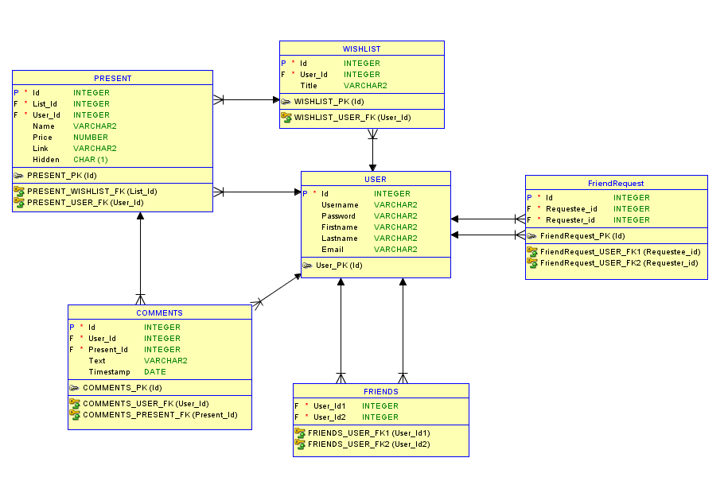

# Alkalmazásfejlesztés beadandó

## Bevezetés

Célunk egy olyan webes applikáció fejlesztése, amely segíti az ajándékozás folyamatát, legyen szó születésnapról, karácsonyról vagy bármilyen más egyéb ünnepről. A programmal, regisztrálás és belépés után, kívánság listákat készíthetünk, amelyet a barátaink (barátnak felvett felhasználók) láthatnak, illetve módosításokat hajthatnak végre rajta, anélkül, hogy azt a lista tulajdonosa láthatná.

## Funkcionális követelmények  
- az app használatához regisztráció/belépés szükséges
- kívánság listákat készíthetünk
  - elnevezhetjük a listát
  - feltölthetjük elemekkel
  - a listaelemek rendelkeznek: névvel, linkkel, árral
- más felhasználók felvétele barátként
  - a barátok láthatják egymás listáit
  - a barátok hozzáadhatnak az eredeti tulajdonos listájához elemeket, de ezt a tulaj nem láthatja
  - kihúzhatnak elemeket, jelölve ezzel azt, hogy már megvásárolták azt
  - a barátok számára látható, hogy ki vásárolta meg az adott elemet
  - a barátok kommentelhetnek a lista elemek alá
- felhasználók közötti keresés

## Nem funkcionális követelmények
- A weboldal elérhető tetszőleges böngészőből
- Szerveroldal
  - Java Spring boot használata (Lombok, Thymeleaf, h2, JPA, HTML, CSS)
  - MVC modell
  - REST API
  - authorizált végpontok
  - A jelszavak mentése hasheléssel történik
- Kliensoldal
  - Angular framework használata
  - Typescript használata
  - a szerverrel AJAX kérésekkel történik a kommunkáció
  - csak hitelesítés után elérhető funckiók bevezetése (autentikáció)

## Adatbázis terv

### Kapcsolatok:

- egy - sok kapcsolatok
  - USER - PRESENT
  - USER- WISHLIST
  - WISHLIST - PRESENT
  - USER - COMMENT
  - PRESENT - COMMENT
- sok - sok kapcsolat
  - USER - USER (FRIENDS kapcsolótáblával) 
  
##  Szerepkörök
- User: Saját listákat hozhat létre, kereshet a felhasználók között és barátok vehet fel. Továbbá hozzáadhat/kihúzhat elemeket a barátok listáiról és kommentelhet is hozzájuk.
- Admin: Belenyúlhat az adatbázisba, módosíthatja a listákat, törölhet felhasználókat stb.

## Készítették:

 * [Negrut Ákos](http://github.com/Zentrom)
 * [Jakab Gergely](http://github.com/gjakab/)